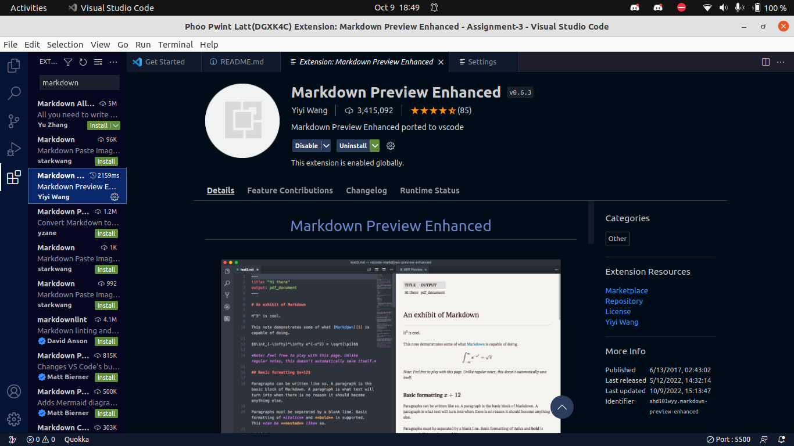
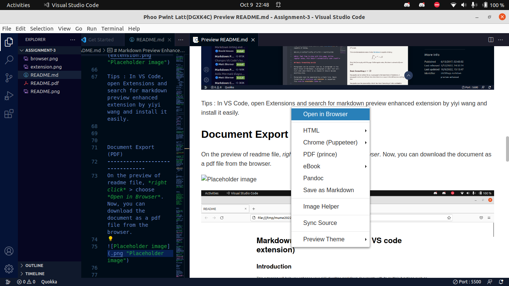
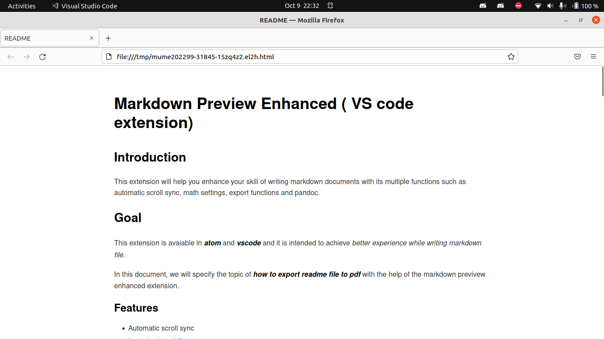

Markdown Preview Enhanced ( VS code extension)
====================

Introduction
----------

This extension will help you enhance your skill of writing markdown documents with its multiple functions such as automatic scroll sync, math settings, export functions and pandoc.


Goal
----------

This extension is avaiable in ***atom*** and ___vscode___ and it is intended to achieve *better experience while writing markdown file*. 

In this document, we will specify the topic of ***how to export readme file to pdf*** with the help of the markdown previvew enhanced extension.


### Features


* Automatic scroll sync
* [Import external files](https://shd101wyy.github.io/markdown-preview-enhanced/#/file-imports)
* [Code Chunk](https://shd101wyy.github.io/markdown-preview-enhanced/#/code-chunk)
* [Pandoc](https://shd101wyy.github.io/markdown-preview-enhanced/#/pandoc)
* Export to
    * PDF
    * JPEG
    * PNG
        * support by Puppeteer
    * HTML
        * mobile device supported
* And many more ...

General Usage
------------------

### Commands

* You can press `cmd-shift-p` in atom editor to toggle Command Palette .
> The `cmd` key for Window is `ctrl`.
*  Right click at the preview to open the context menu: 

    

Keyboard Shortcuts
--------------------

| Shortcuts | Functions |
|-----------------------|-----------------------|
| `ctrl-shift-m`           | Toggle preview        |
| `cmd-0` | Reset Zoom          |
| `cmd--` or `cmd-shift-_`  | Preview Zoom Out          |
| `cmd-=` or `cmd-shift-=`   | Preview Zoom In          |

Installation
------------
___Install from VS Code (Recommended)___



Tips : In VS Code, open Extensions and search for markdown preview enhanced extension by yiyi wang and install it easily.


Document Export (PDF)
--------------------------------
On the preview of readme file, *right click* > choose *Open in Browser*. Now, you can download the document as a pdf file from the browser.






Press `cmd-shift-p` and run ***Markdown Preview Enhanced: Customize Css*** command to open ***style.less*** file, then you can customize your pdf file with css properties:

```css
.markdown-preview.markdown-preview {
  @media print {
    // your code here
  }
}
```

***

Alternative method to export to PDF
---------------------

If you have already installed or currently using chrome browser app, you can export to pdf file by the following way:

On the preview of readme file, *right click* > choose *Chrome (Puppeteer)*. 

Then, if you want, you can configure the pdf document format like this :

```yaml
puppeteer:
  landscape: true
  format: "A4"
  timeout: 3000 # <= Special config, which means waitFor 3000 ms
```

For ***macOS***, you can install *prince* by opening the terminal and run the following code:

```sh
brew install Caskroom/cask/prince
```

Then, on the preview of readme file, *right click* > choose *Prince(PDF)* as usual.


Feedbacks
-----------

> *"Wonderful Extension! It helps me a lot in my coding life by making the use of markdown easier and undersandable."* __ Mark (kodecom.)
***
> *"Very good! Waiting for more and more interesting features..."*__ Susan (Nokia.)


